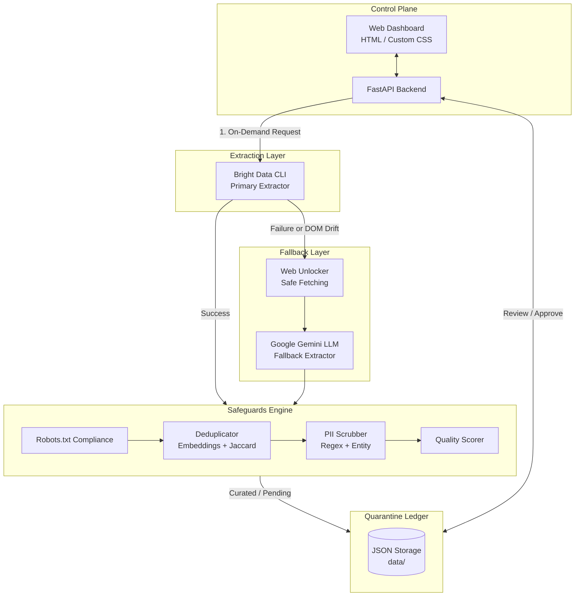

<div align="center">


# AutoML-Scraper

### *Self-Healing Web Scraping & Specimen Curation Registry*

**An automated data curation pipeline for LLM training that scrapes domain-specific websites, self-heals broken layouts, deduplicates, and scrubs PII — producing high-quality datasets on autopilot.**

[](https://python.org)
[](https://fastapi.tiangolo.com/)
[](https://brightdata.com/)
[](LICENSE)

</div>

---

<div align="center">

<h2 id="live-demo--video-walkthrough"> Live Demo </h2>

**Live Application:** [https://automl-scraper.onrender.com](https://automl-scraper.onrender.com)

</div>

---

<h2 id="table-of-contents"> Table of Contents</h2>

- [The Problem](#the-problem)
- [Solution Overview](#solution-overview)
- [Architecture](#architecture)
- [Key Features](#key-features)
- [Bright Data Integration](#bright-data-integration)
- [Dashboard Views](#dashboard-views)
- [Repository Structure](#repository-structure)
- [Getting Started](#getting-started)
- [Tech Stack](#tech-stack)

---

<h2 id="the-problem"> The Problem</h2>

You spend weeks building web scrapers for your LLM datasets. You launch them. You breathe easy.

Then, three months later:
- Websites change their DOM layout, breaking your CSS selectors and returning `null`.
- Your extracted data is filled with duplicates and poor-quality boilerplate text, ruining your model's training.
- Scraping bots get blocked by advanced anti-bot systems like Cloudflare or DataDome.
- Personal Identifiable Information (PII) leaks into your dataset, violating privacy constraints.

**The painful reality: your data ingestion pipeline is fragile and requires constant babysitting.**

---

<h2 id="solution-overview"> Solution Overview</h2>

AutoML-Scraper is a **self-healing data curation registry**.

It continuously scrapes target websites on-demand using Bright Data's infrastructure. When a target website's layout breaks, an AI-powered diagnostic engine detects the drift, generates a natural language repair prompt, and uses an LLM (Google Gemini) to auto-heal the extraction logic. Collected data is then rigorously deduplicated using SentenceTransformer embeddings (Cosine Similarity) with a Jaccard fallback, scrubbed of PII, and placed in a quarantine workflow for human approval before export.

**Three-word summary: Scrape → Auto-Heal → Curate.**

---

<h2 id="architecture"> Architecture</h2>



* **Extraction Layer**: Bright Data Scraper Studio CLI (`bdata scrape`) for primary extraction.
* **Fallback Layer**: Safe Fetching (using Web Unlocker infrastructure to bypass captchas and rendering blocks) + Google Gemini LLM fallback extraction.
* **Safeguards Engine**: Deduplicator (Embeddings + Jaccard), PII Scrubber (Regex + Entity matching), Quality Scorer, Robots.txt compliance.
* **Control Plane**: FastAPI Backend + HTML/Custom CSS (Kintsugi theme) web dashboard.
* **Quarantine Ledger**: JSON-based storage (`data/`) holding raw, pending, and curated specimens.

---

<h2 id="key-features"> Key Features</h2>

| # | Feature | What It Does | Implementation |
|---|---------|-------------|----------------|
| 1 | **Scraper Studio Integration** | Invokes Bright Data CLI for primary template-based extraction | `pipeline/ondemand/primary_extractor.py` |
| 2 | **Auto-Healer (DOM Drift Detection)** | Identifies when extracted fields are empty and triggers self-healing using AI | `healing/healer.py` + `pipeline/ondemand/gemini_extractor.py` |
| 3 | **Near-Duplicate Detection** | Prevents poisoning datasets with duplicate content using SentenceTransformer embeddings (Cosine Similarity) & Jaccard fallback | `pipeline/deduplicator.py` |
| 4 | **PII Scrubbing** | Redacts Emails and Phone Numbers from text before saving | `pipeline/cleaner/pii_redactor.py` |
| 5 | **Quality Scoring** | Evaluates boilerplate ratio, text density, and assigns a composite 0-100 score | `pipeline/quality_scorer.py` |
| 6 | **Quarantine & Approval Workflow** | Stages extracted specimens into a quarantine state allowing human review via dashboard | `pipeline/ondemand/quarantine_repository.py` |
| 7 | **Heuristic LLM Fallback** | Falls back to Google Gemini if Primary Bright Data extractor encounters errors | `pipeline/ondemand/gemini_extractor.py` |

---

<h2 id="bright-data-integration"> Bright Data Integration</h2>

This project deeply integrates with Bright Data's global proxy and scraping infrastructure to gracefully recover from extraction failures and maximize extraction success.

| Component | Description |
|---|---|
| `bdata scrape` CLI | Globally installed CLI wrapper to execute highly-concurrent scraping sessions |
| Web Unlocker API | Direct REST API `POST /request` fallback providing CAPTCHA solving, browser fingerprinting, and auto-retries |
| CLI Zone Management | Uses `--zone cli_unlocker` dynamically to route traffic through the correct residential proxy pools |

**Demo Note (Keyword-Based Simulated Failure):**
For demonstration purposes in Mock Mode, submitting URLs containing `"fail"`, `"drift"`, `"error"`, or `"unhealthy"` forces a simulated extraction failure, dynamically routing the workflow through the healer and fallback pathways.

---

<h2 id="dashboard-views"> Dashboard Views</h2>

The web dashboard (HTML + Custom CSS Kintsugi Theme + JavaScript) provides a unified control panel:

| View | Description |
|---|---|
| **Overview Stats** | Animated KPI cards showing Total Yield, Discarded, Duplicates Removed, and Avg Quality Score |
| **Ledger of Scraper Records** | Historical log of on-demand scrape runs |
| **Specimen Catalog** | Filterable grid of curated dataset items |
| **Quality Stats** | Visualizations for extraction confidence and boilerplate ratios |
| **Repair History / Quarantine** | Interface to review, approve, or reject auto-healed extraction patches |

---

<h2 id="repository-structure"> Repository Structure</h2>

```text
├── data/                  # Local JSON data ledger (Curated, Quarantined, Scored)
├── healing/               # AI Auto-healer modules (DOM drift detection)
├── monitoring/            # FastAPI Backend, Dashboard Templates, and Logger
├── pipeline/              # ETL Core
│   ├── cleaner/           # PII Redaction and HTML cleaning
│   ├── ondemand/          # Primary Extractor, Gemini Fallback, Quarantine Logic
│   ├── scraper_runner/    # Runner polling and async triggers
│   ├── deduplicator.py    # Embeddings-based near-duplicate detection
│   └── quality_scorer.py  # Evaluates text density and boilerplate ratio
├── scrapers/              # Bright Data CLI integration (studio_cli.py, scraper_manager.py)
├── scripts/               # Utility scripts (run_pipeline, export_training_data)
├── tests/                 # 79+ Comprehensive pytest suite
├── run_server.py          # Unified entrypoint
└── render.yaml            # Render deployment configuration
```

---

<h2 id="getting-started"> Getting Started</h2>

### 1. Prerequisites
- Python 3.11+
- Node.js (`npm` is required for Bright Data CLI)
- Bright Data Account (API Key & Org ID)
- Google Gemini API Key

### 2. Installation

```bash
# Clone the repository
git clone https://github.com/sanketdedhia7/AutoML-Scraper.git
cd AutoML-Scraper

# Create and activate virtual environment
python -m venv venv
source venv/bin/activate  # Or venv\Scripts\activate on Windows

# Install Python dependencies
pip install -r requirements.txt

# Install Bright Data CLI globally
npm install -g @brightdata/cli
```

### 3. Configuration

Create a `.env` file in the root directory:
```env
BRIGHT_DATA_API_KEY=your_bright_data_api_key
BRIGHT_DATA_ORG_ID=your_bright_data_org_id
GEMINI_API_KEY=your_gemini_api_key
DISCORD_WEBHOOK_URL=your_discord_webhook_url # Optional
DISABLE_SENTENCE_TRANSFORMERS=1 # Optional (speeds up local dev)
```

### 4. Running the Dashboard

```bash
python run_server.py
```
Navigate to `http://localhost:8000` to access the Self-Healing Web Scraping Registry.

---

<h2 id="tech-stack"> Tech Stack</h2>

- **Backend**: Python, FastAPI, Uvicorn
- **AI & NLP**: Google Gemini API, SentenceTransformers
- **Scraping Infrastructure**: Bright Data Web Unlocker, `@brightdata/cli`, Trafilatura, BeautifulSoup4
- **Frontend**: HTML5, Custom CSS Kintsugi Theme, Vanilla JS
- **Deployment**: Render

---

<h2 id="license"> License</h2>

This project is licensed under the MIT License - see the [LICENSE](LICENSE) file for details.
