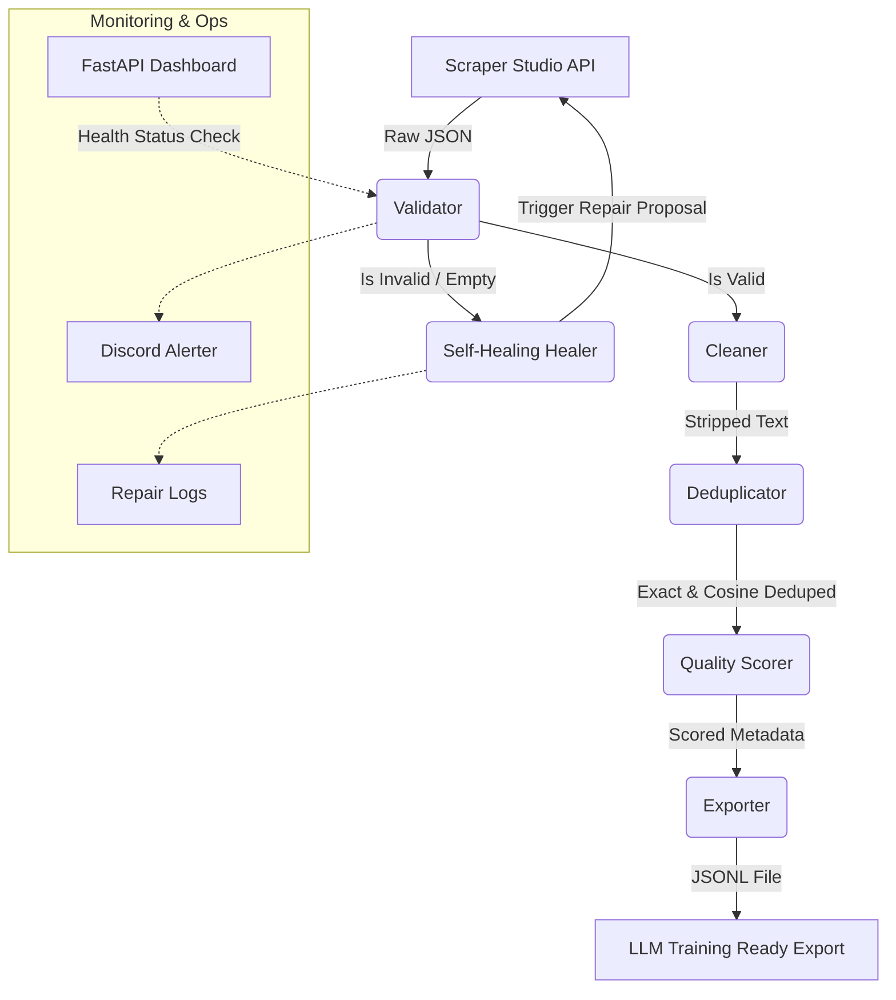

# AutoML Data Curator Architecture

This document describes the technical architecture and pipeline structure of the AutoML Data Curator.

## Overview

The AutoML Data Curator is a modular Python ETL framework designed to scrape web sources, validate their raw responses, automatically repair layout mismatches via Bright Data Scraper Studio's healing API, clean, deduplicate, score quality, and export LLM-ready datasets.

## Component Block Diagram

## Folder Layout
- `scrapers/`: Setup scraper schemas and manager interaction classes.
- `pipeline/`: Standard ETL units (runner, cleaner, deduplicator, scorer, exporter).
- `healing/`: Prompt-generation logic and repair execution wrappers.
- `monitoring/`: Core FastAPI operations board and instant notification webhooks.
